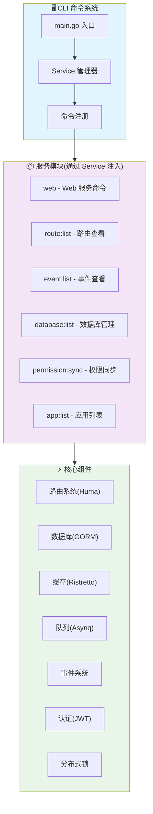

<h1 align="center">Go-Fast v2</h1>

<p align="center">
  <strong>🚀 基于 Huma 的轻量级 Go Web 框架</strong>
</p>

<p align="center">
  一个单体优先、快速开发的现代化 Go 框架，专注于简单高效的应用构建
</p>

<p align="center">
  <a href="https://github.com/duxweb/go-fast" target="_blank">🏠 GitHub</a> |
  <a href="https://www.dux.cn" target="_blank">🌐 官网</a>
</p>

<p align="center">
  
  
  
</p>

---

## ✨ 核心特性

* 🚀 **轻量级设计** - 单体架构优先，简单高效，快速上手
* 🎯 **CLI 驱动** - 整个框架基于 CLI 命令系统，所有功能通过命令调用
* 🛡️ **OpenAPI 优先** - 基于 Huma 框架，自动生成 API 文档，类型安全
* 📦 **模块化架构** - 通过 Service 注入机制，灵活组织业务模块
* 🔧 **内置组件** - 缓存、队列、事件、认证等开箱即用
* 🎨 **现代化开发** - 依赖注入、中间件、泛型支持
* 🔒 **企业级安全** - JWT 认证、权限管理、请求限流

## 🏗️ 架构设计

Go-Fast v2 是一个基于 CLI 命令的单体框架，所有功能通过 Service 注入并以命令方式启动：



## 📦 核心组件

| 组件模块 | 功能描述 | 访问方式 |
|---------|---------|---------|
| 🧭 **路由系统** | 基于 Huma 的 OpenAPI 优先路由管理 | `route.Register()` |
| 💾 **数据库层** | 基于 GORM 的数据库操作，支持多数据库 | `database.Gorm()` |
| 🗄️ **缓存系统** | 基于 Ristretto v2 的高性能缓存 | `cache.Cache()` |
| 📋 **队列系统** | 基于 Asynq 的分布式任务队列 | `queue.Queue()` |
| 📡 **事件系统** | 事件驱动编程，支持同步和异步处理 | `event.Fire()` |
| 🔐 **认证授权** | JWT 认证和权限管理 | `jwt.Parse()` |
| 💿 **存储系统** | 统一的文件存储接口 | `storage.Storage()` |
| 📊 **日志系统** | 结构化日志记录系统 | `logger.Log()` |
| 🔒 **分布式锁** | 支持内存和 Redis 的分布式锁 | `lock.Lock()` |

## 🚀 快速开始

### 环境要求

- **Go**: 1.22 或更高版本
- **数据库**: MySQL 8.0+、PostgreSQL 13+、SQLite 3.8+
- **Redis**: 6.0+（队列和缓存）

### 安装

```bash
# 克隆项目
git clone https://github.com/duxweb/go-fast-v2
cd go-fast-v2

# 安装依赖
go mod download

# 复制配置文件
cp config.example.yaml config.yaml
```

### 启动服务

```bash
# 查看所有可用命令
go run main.go

# 启动 Web 服务
go run main.go web

# 访问 http://localhost:8080
# API 文档 http://localhost:8080/docs
```

## 💻 使用示例

### 路由示例

基于实际示例 `example/app/system/web/test.go`：

```go
package web

import (
    "context"
    "github.com/danielgtaylor/huma/v2"
    "github.com/duxweb/go-fast/v2/resp"
    "github.com/duxweb/go-fast/v2/route"
)

// TestInput 测试输入结构
type TestInput struct {
    ID   string `path:"id" example:"1" doc:"测试ID"`
    Name string `json:"name" example:"test" doc:"测试名称"`
}

// TestData 测试数据结构
type TestData struct {
    ID   string `json:"id" example:"1" doc:"测试ID"`
    Name string `json:"name" example:"test" doc:"测试名称"`
}

// Test 路由注册
func Test() {
    group := route.GetRouter("web")

    route.Get(group, "/test/{id}", "test", huma.Operation{
        OperationID: "getTest",
        Summary:     "获取测试数据",
        Description: "根据ID获取测试数据",
        Tags:        []string{"test"},
    }, func(ctx context.Context, input *TestInput) (*resp.HumaResponse[TestData, resp.EmptyMeta], error) {
        data := TestData{
            ID:   input.ID,
            Name: input.Name,
        }

        return resp.Send(ctx, resp.Data[TestData, resp.EmptyMeta]{
            Data: data,
            Meta: resp.EmptyMeta{},
        }), nil
    })
}
```

### 服务注册

每个模块通过 Service 注册到系统中：

```go
package web

import (
    "context"
    "github.com/duxweb/go-fast/v2/service"
    "github.com/urfave/cli/v3"
)

func Service() *service.Config {
    return &service.Config{
        Name: "web",
        Init: Init,    // 初始化
        Boot: Boot,    // 启动
        Cmd:  Command, // CLI 命令
    }
}

func Command() []*cli.Command {
    return []*cli.Command{{
        Category: "service",
        Name:     "web",
        Usage:    "starting the web service",
        Action: func(context.Context, *cli.Command) error {
            // 启动 Web 服务
            Start()
            return nil
        },
    }}
}
```

## 🔧 CLI 命令

整个框架基于 CLI 命令系统，所有功能都通过命令调用：

```bash
# 查看所有可用命令
go run main.go

# 服务命令
go run main.go web               # 启动 Web 服务
go run main.go version           # 查看版本信息

# 调试命令
go run main.go route:list        # 查看所有路由列表
go run main.go event:list        # 查看所有事件监听器
go run main.go database:list     # 查看数据库信息
go run main.go app:list          # 查看应用列表

# 管理命令  
go run main.go permission:sync   # 同步权限数据
```

## 🚀 部署指南

### Docker 部署

```dockerfile
# Dockerfile
FROM golang:1.22-alpine AS builder

WORKDIR /app
COPY go.mod go.sum ./
RUN go mod download

COPY . .
RUN CGO_ENABLED=0 GOOS=linux go build -o main .

FROM alpine:latest
RUN apk --no-cache add ca-certificates tzdata
WORKDIR /root/

COPY --from=builder /app/main .
COPY --from=builder /app/config.yaml .

EXPOSE 8080
CMD ["./main", "web"]
```

### Systemd 服务

```ini
# /etc/systemd/system/go-fast.service
[Unit]
Description=Go-Fast Web Service
After=network.target

[Service]
Type=simple
User=www-data
WorkingDirectory=/var/www/go-fast
ExecStart=/var/www/go-fast/main web
Restart=on-failure

[Install]
WantedBy=multi-user.target
```

## 🤝 参与贡献

我们欢迎所有形式的贡献！

### 贡献方式

1. Fork 本仓库
2. 创建特性分支 (`git checkout -b feature/AmazingFeature`)
3. 提交更改 (`git commit -m 'Add some AmazingFeature'`)
4. 推送到分支 (`git push origin feature/AmazingFeature`)
5. 创建 Pull Request

### 开发规范

- 代码格式化：使用 `gofmt` 和 `goimports`
- 代码检查：通过 `golangci-lint` 检查
- 测试覆盖：保持 80% 以上的测试覆盖率
- 提交规范：遵循 Conventional Commits

## 📄 开源协议

本项目基于 [MIT](LICENSE) 协议开源，您可以自由使用、修改和分发。

## 👥 作者

**DuxWeb 团队**

- 🌐 官网: [https://www.dux.cn](https://www.dux.cn)
- 📧 邮箱: admin@dux.cn
- 🐙 GitHub: [@duxweb](https://github.com/duxweb)

## ⭐ 支持项目

如果这个项目对您有帮助，请给我们一个 ⭐️！

您的支持是我们持续改进的动力。

---

<p align="center">
  <strong>🎉 感谢使用 Go-Fast！</strong>
</p>

<p align="center">
  <a href="https://github.com/duxweb/go-fast">🏠 GitHub</a> •
  <a href="https://github.com/duxweb/go-fast/issues">🐛 报告问题</a> •
  <a href="https://github.com/duxweb/go-fast/discussions">💡 功能建议</a>
</p>